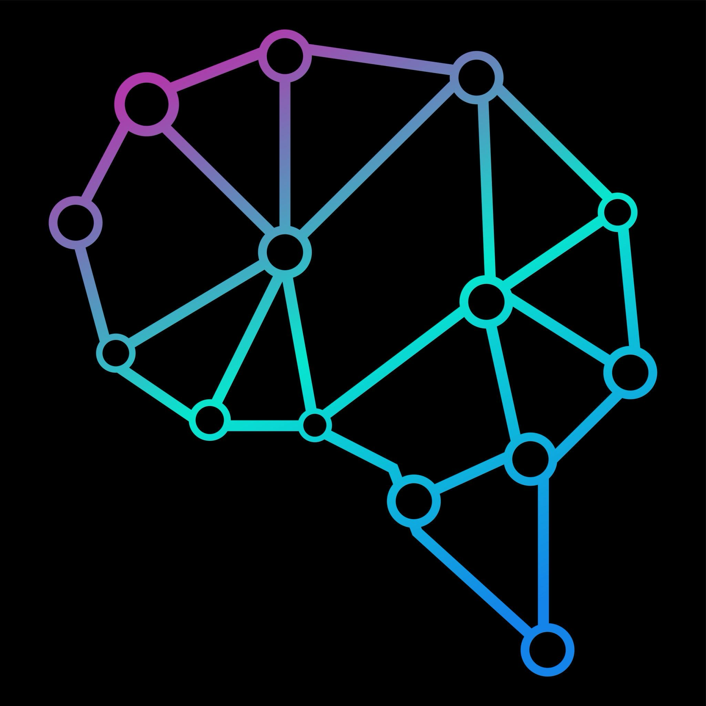

<p align="center">
  
</p>

<h1 align="center">GenosOS</h1>

<p align="center">
  <strong>Your private AI assistant — across every channel</strong>
</p>

<p align="center">
  Self-hosted. Encrypted by default. Connects to WhatsApp, Telegram, Slack, Discord, and more.<br>
  Configure everything by talking — no files to edit, no dashboards to learn.
</p>

<p align="center">
  <a href="#quick-start">Quick Start</a> &nbsp;·&nbsp;
  <a href="VISION.md">Vision</a> &nbsp;·&nbsp;
  <a href="ARCHITECTURE.md">Architecture</a> &nbsp;·&nbsp;
  <a href="SECURITY.md">Security</a> &nbsp;·&nbsp;
  <a href="CONTRIBUTING.md">Contributing</a>
</p>

---

## Why GenosOS

Most AI assistants are stateless — they forget who you are between sessions. Most are cloud-only — your conversations live on someone else's server. Most require technical setup — config files, environment variables, deployment scripts.

GenosOS is different:

- **Runs on your hardware.** Your conversations never leave your machine.
- **Encrypted by default.** AES-256-GCM encryption at rest. Not optional — mandatory.
- **Remembers you.** Structured memory with semantic search. Your assistant knows your preferences, your projects, your context.
- **Works across channels.** One assistant, connected to WhatsApp, Telegram, Slack, Discord, Signal, iMessage, and more.
- **Configured by talking.** Say "connect my WhatsApp" instead of editing JSON files.

```
You:  "Connect my WhatsApp"
      → QR code appears, you scan it, done.

You:  "Only let my contacts message me"
      → Security policies configured automatically.

You:  "Create an assistant for my dental clinic"
      → Specialized agent deployed with appointment scheduling
        and patient communication — in one conversation.
```

## Quick Start

```bash
# Install Bun (if not installed)
curl -fsSL https://bun.sh/install | bash

# Clone and setup
git clone https://github.com/estebanrfp/genos.git
cd genos
pnpm setup

# Start — asks for API keys on first run, then opens browser
bun genosos.mjs gateway
```

On first run, you will be asked for your **LLM API key** (Anthropic or OpenAI) and **embeddings API key** (OpenAI or Gemini). The browser opens automatically — everything else is configured by talking to the agent.

## Channels

**Core messaging:**

| Channel  | Library      | Status     |
| -------- | ------------ | ---------- |
| WhatsApp | Baileys      | Production |
| Telegram | grammY       | Production |
| Slack    | Bolt         | Production |
| Discord  | discord.js   | Production |
| Signal   | signal-utils | Production |
| iMessage | macOS native | Production |

**Voice:**

| Channel       | Technology                      | Status       |
| ------------- | ------------------------------- | ------------ |
| Voice Calls   | Twilio/Telnyx + OpenAI Realtime | Production   |
| Realtime Call | OpenAI Realtime (bidirectional) | Experimental |
| Local TTS     | Kokoro (on-device, no cloud)    | Production   |

**Additional:** Google Chat, Microsoft Teams, Matrix, Nostr, Twitch, LINE, WebChat

One assistant, all your channels. Messages from any channel land in the same conversation — with full memory and context.

## Features

### Talk to configure

No config files. No dashboards. The agent understands 25 configuration actions, validated by 164 server-side blueprints. Say what you want — the agent handles the how.

### Memory that persists

Your assistant remembers who you are across sessions. Structured compaction with TOON encoding reduces token usage by ~40% while preserving meaning. Semantic prefetch injects relevant context before every response — automatically.

### Multi-agent system

Create specialist agents for different domains. A dental clinic assistant, a research agent, a customer service bot — they delegate to each other automatically via A2A communication.

### Agent templates

12 pre-built templates: dental clinic, law firm, restaurant, online store, real estate, and more. Deploy a specialized assistant in one conversation.

### Voice

Bidirectional voice calls via Twilio/Telnyx/Plivo + OpenAI Realtime. Local text-to-speech via Kokoro — no audio leaves your machine.

## Security

GenosOS was built with the premise that **a personal assistant holds sensitive information — security is not optional**.

### Encrypted by default

All config and credentials are encrypted with **AES-256-GCM** (PBKDF2 100K iterations). Once a vault passphrase is set, every write is encrypted automatically. The agent does not know it is encrypting — it is transparent.

### Hardened against real threats

GenosOS was [audited against 40,000+ publicly exposed AI assistant instances](SECURITY-AUDIT.md) reported in security research. Every attack vector resolved by default — no manual hardening required.

- Gateway binds to loopback only — refuses to start on public interfaces without auth
- DM pairing by default — unknown senders cannot reach the agent
- Channel tool restrictions — messaging channels cannot run shell commands
- Tamper-evident audit log with HMAC checksums

### Fortress Mode

Full hardening in one command:

```bash
bun genosos.mjs agent --message "harden security"
```

Enables: macOS Keychain storage, buffer zeroing, SQLite hardening, Spotlight/Time Machine exclusion, vault auto-lock (30 min), rate limiting.

## Architecture

```
WhatsApp · Telegram · Slack · Discord · Signal · iMessage · Voice
                              │
                        ┌─────┴─────┐
                        │  Gateway   │  ← single entry point
                        │  :18789    │
                        └─────┬─────┘
                              │
            ┌─────────────────┼─────────────────┐
            │                 │                 │
      Multi-Agent        Memory + TOON     Tools + Skills
      System (A2A)       Compaction        62 available
```

- **Runtime:** Bun (native SQLite, instant startup)
- **Language:** Pure JavaScript (ES2024+) — no TypeScript, no build step for development
- **Tests:** 738 suites, 6,140+ tests (Vitest)
- **Extensions:** Plugin system with 21 bundled extensions

See [ARCHITECTURE.md](ARCHITECTURE.md) for design decisions, module map, and roadmap.

## Development

```bash
pnpm setup            # install + build + ui
pnpm test:fast        # run unit tests
pnpm gateway:watch    # dev loop with hot reload
```

See [CONTRIBUTING.md](CONTRIBUTING.md) for guidelines.

## Documentation

| Document                               | Description                                         |
| -------------------------------------- | --------------------------------------------------- |
| [ARCHITECTURE.md](ARCHITECTURE.md)     | Design decisions, module map, implementation phases |
| [VISION.md](VISION.md)                 | Philosophy and technical direction                  |
| [SECURITY.md](SECURITY.md)             | Security model and encryption details               |
| [SECURITY-AUDIT.md](SECURITY-AUDIT.md) | 10-point vulnerability audit                        |
| [docs/](docs/)                         | Install guides, channel setup, provider config      |

## License

[MIT](LICENSE)

## Author

Esteban Fuster Pozzi ([@estebanrfp](https://github.com/estebanrfp)) — Full Stack JavaScript Developer

## Acknowledgments

GenosOS is built on the channel infrastructure pioneered by [OpenClaw](https://github.com/openclaw/openclaw), created by Peter Steinberger and the community. The architecture, security model, memory system, and conversational configuration are original work.
